# Tutorial Vessicchio tour

## Teoria

### Scala maggiore
\label{sec:scala}

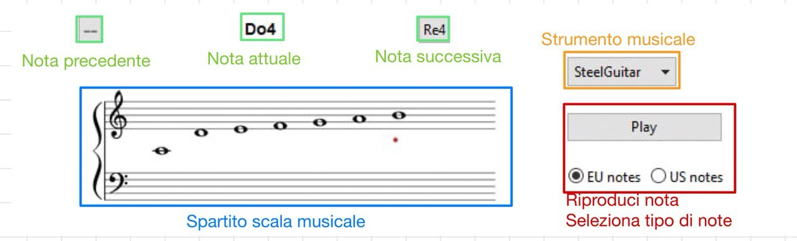

Nell'esercizio sulla scala maggiore (in figura \ref{fig:scala}), è possibile navigare le note con i pulsanti in alto. Fra i due pulsanti è visualizzalo il nome della nota selezionata. Premendo play la si riproduce con il suono selezionato nell'apposito menù a più voci. I due radio buttons in basso a destra permettono di scegliere quale notazione utilizzare per il nome della nota: quella europea (Do, Re, Mi, ...) oppure quella americana (C, D, E, ...).

### Intervalli
\label{sec:intervalli}

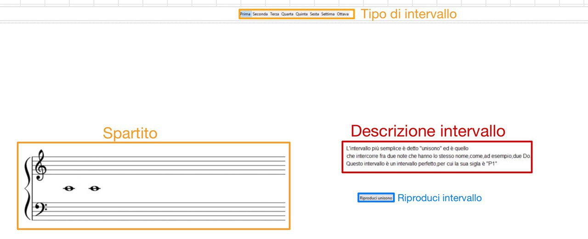

Nel pannello descrittivo sugli intervalli (in figura \ref{fig:intervallit}) è possibile navigare le sette famiglie di intervalli con i pulsanti centrali in alto. Nella sezione di sinistra viene mostrata un'immagine dell'intervallo sullo spartito a partire dal Do centrale (C4). Alla fine della descrizione delle sonorità associate all'intervallo e della nomenclatura specifica, è possibile riprodurlo nei vari modi in cui è stato descritto premendo il bottone a piè del panel.

### Esercizio di ascolto sugli intervalli

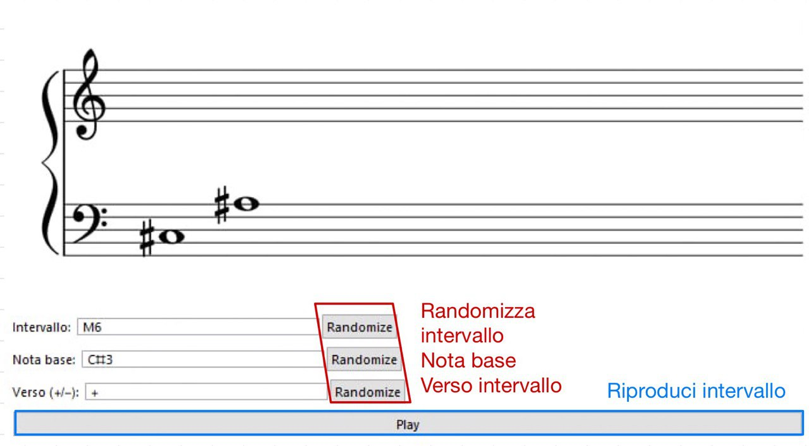

Nell'esercizio sugli intervalli (in figura \ref{fig:intervallia}) è possibile navigare gli intervalli tramite il loro nome, vederli stampati sullo spartito ed ascoltarli rappresentati. I controlli sono i seguenti:

- Il primo parametro è il nome dell'intervallo da rappresentare, secondo la notazione introdotta nella sezione precedente (\ref{sec:intervalli})
- Il secondo parametro richiede il nome della prima nota dell'intervallo espresso in notazione americana introdotta nella sezione \ref{sec:scala}. È anche possibile utilizzare delle ottave diverse da quella centrale, cambiando il numero a fianco del nome della nota (ad esempio usando "C5" anziché "C4").
- Il terzo parametro richiede due soli valori: "+" o "-" per indicare rispettivamente il verso ascendente o discendente dell'intervallo.

### Accordi
\label{sec:accordi}

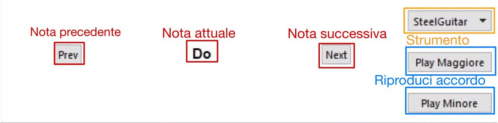

Nell'esercizio di ascolto sugli accordi (in figura \ref{fig:accordit}) è possibile navigare le sette note della scala di Do maggiore con i pulsanti centrali. Nella sezione di destra è possibile scegliere uno strumento con cui sarà riprodurre l'accordo maggiore o minore con i due pulsanti "Play Maggiore" e "Play Minore" sulla destra.

### Strumenti musicali
\label{sec:strumenti}

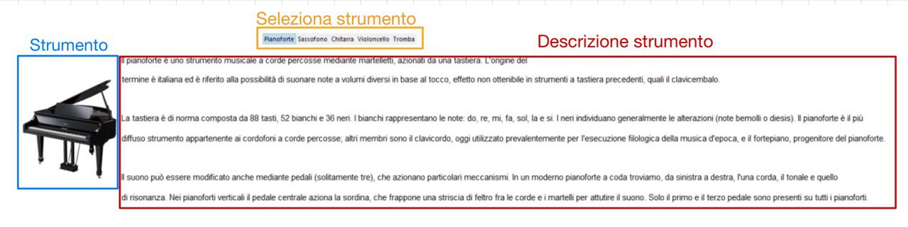

Nel pannello descrittivo sugli strumenti (in figura \ref{fig:intervallit}) è possibile navigare alcuni celebri strumenti musicali premendo i pulsanti in alto. Nella sezione di sinistra viene mostrata un'immagine dello strumento selezionato sullo spartito a partire dal Do centrale (C4). Sulla destra vengono descritte le principali caratteristiche dello strumento selezionato.

### Esercizio di ascolto e lettura
\label{sec:ascolto}

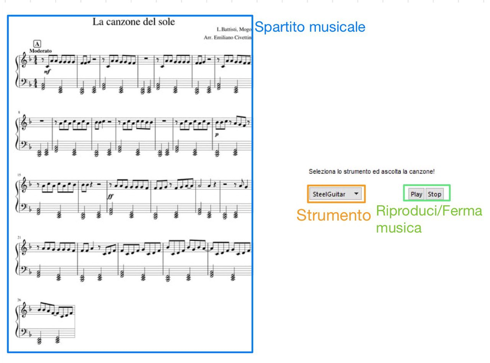

Nell'esercizio di ascolto è possibile selezionare uno strumento con il quale riprodurre la canzone mostrata in figura. Premendo il pulsante "Play" si inizia la riproduzione dello spartito con lo strumento selezionato, mentre con il pulsante "Stop" la riproduzione viene fermata.

## Pratica

### Quiz
\label{sec:quiz}

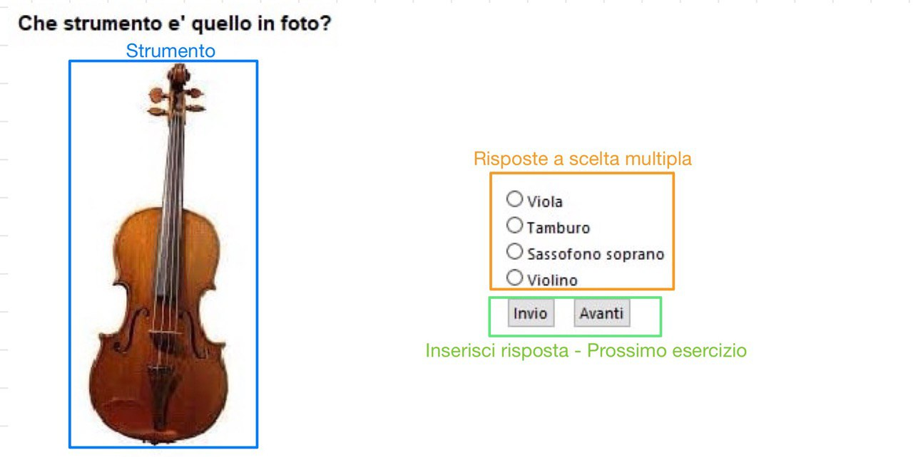

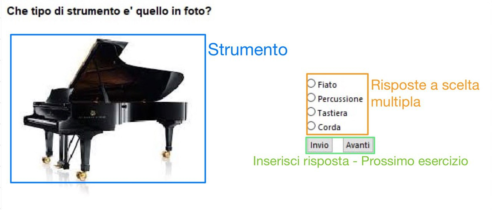

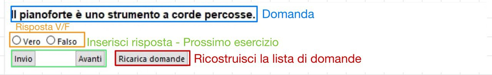

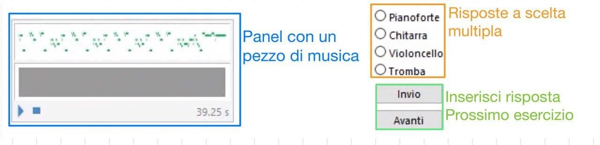

I quiz di verifica delle conoscenze apprese nella sezione di teoria si utilizzano selezionando la risposta alla domanda mostrata in alto a sinistra, fra quelle disponibili. Il pulsante "Invio" permette di controllare la risposta selezionata, mentre con il pulsante "Avanti" è possibile caricare la domanda successiva.

Il quiz di teoria generale sugli strumenti (in figura \ref{fig:quiz3}) musicali presenta anche un pulsante "Ricarica domande" che permette di ricominciare da capo con il quiz.

Il quiz sul suono degli strumenti musicali (in figura \ref{fig:quiz4}) presenta un pannello interattivo tramite il quale è possibile riprodurre una traccia con uno strumento estratto in maniera casuale utilizzando i tasti $\triangleright$ e $\square$.

### Esercizio di ascolto sugli intervalli
\label{sec:intervallie}

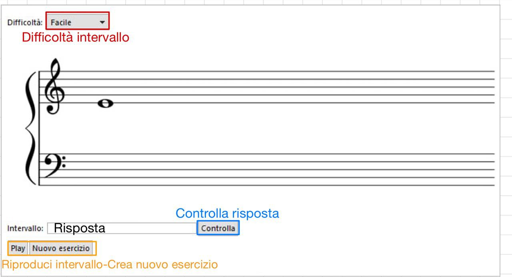

L'esercizio di ascolto sugli intervalli ha lo scopo di verificare le competenze apprese nella sezione \ref{sec:intervalli}.

Il menù a tendina permette di scegliere la difficoltà dell'esercizio, da "Facile", in cui vengono riprodotti solo alcuni fra gli intervalli più frequenti, a "Difficile" in cui vengono riprodotti tutti i possibili intervalli.

A destra del pannello è visualizzata una tabella in cui viene riassunta la nomenclatura degli intervalli per permettere di completare più agevolmente l'esercizio.

Premendo il pulsante "Play" viene riprodotto l'intervallo, dopodiché all'utente è chiesto di inserire il nome dell'intervallo in sigla, i.e. secondo la nomenclatura nella terza colonna della tabella di destra.

Premendo il pulsante "Controlla", viene visualizzato un feedback sulla risposta dell'utente. 

- In caso di risposta corretta, viene visualizzata anche la seconda nota sull'immagine dello spartito.
- In caso di risposta errata, in basso a sinistra viene visualizzato un messaggio di errore, ma non la risposta corretta, cosicché l'utente possa provare a rispondere nuovamente.

Premendo il pulsante "Nuovo esercizio", viene generato automaticamente un nuovo esercizio.

### Esercizio di ascolto sugli accordi
\label{sec:accordie}

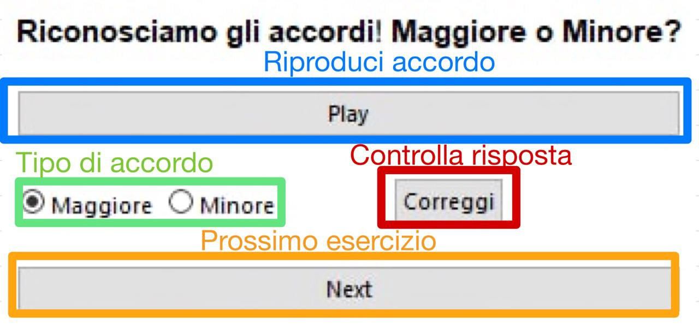

L'esercizio di ascolto sugli accordi ha lo scopo di verificare le competenze apprese nella sezione \ref{sec:accordi}.

Premendo il pulsante "Play" viene riprodotto un accordi. L'utente deve selezionare se l'accordo ascoltato è maggiore o minore. Premendo il pulsante "Correggi" viene controllata la risposta: in base alla risposta, viene visualizzato il messaggio "Corretto!" o "Sbagliato!". Premendo il pulsante "Next" è possibile generare un nuovo esercizio.

